# PELA Blocks

## LEGO-compatible Parametric 3D Printed Blocks

PELA blocks are designed for easy 3D printing, strength, and rapid customization using free software. One time calibration gives perfect snap-together objects in exotic materials and geometries to help you explore your ideas and build with exotic materials and any motors and electronics you like. Example enclosures with many options for custom sensors, actuators, computers and IoT devices are included, or create your own.

These designs are not by the LEGO corporation. LEGO-compatible blocks are available from multiple manufacturers. Associated patents expired long ago in a forgotten age.

The name PELA comes from the Finnish "pelataan" meaning "let's play". **Pelataan.**

## Open source design, Powered By Futurice

These open source designs are brought to you by [Futurice](https://futurice.com) and contributions from the community. Come work with the best.

The software needed is free and open source, [OpenSCAD](http://www.openscad.org/). You can probably learn it in less than an hour.

## Download

**The STL files shown are examples only.** To get a good snap fit with your 3D print, you need to fine tune the size of top and bottom connectors. It is also easy to personalize PELA designs- start by turning on or off optional features.

1. **[DOWNLOAD](https://github.com/LEGO-compatible-gadgets/PELA-parametric-blocks/archive/master.zip)** the latest designs, or `git clone git@github.com:LEGO-Prototypes/PELA-parametric-blocks.git --recurse-submodules`, then `git lfs install` in each git module
1. **[Calibrate](#calibrate)** the PELA Block models for your material and printer

## Advanced Setup

See [Advanced Setup](ADVANCED-SETUP.md) for additional tricks sparse update to save you space and bandwidth, Raytraced image generation, command line STL cleanup and and batch file generation of all models when you change filaments.

## Slicer Recommendations

See the [Slicer Recommendations](SLICER.md) for settings recommendations and material information.

## Calibrate

To get a perfect LEGO-compatible and technic-compatible fit, do some test fits against a printed calibration block tune 3 numbers before generating the STL model for your plastic and printer.

___

Print one of the 4 calibration blocks below. Test fit some LEGO on the top and bottom to find the perfect fit. Test fit a technic connector on the side. When you update those material settings in  [`print-style.scad`](https://github.com/PELA-Prototypes/parametric-PELA/blob/master/print-style.scad) then one time calibration is complete.

___

[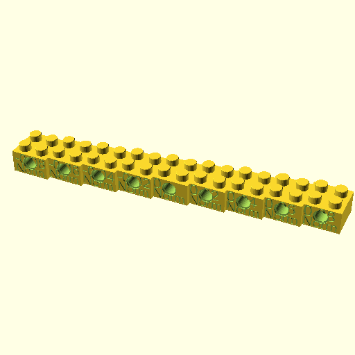](https://github.com/LEGO-compatible-gadgets/PELA-parametric-blocks-render/blob/master/PELA-calibration-norm-thin.stl)

[PELA Calibration Bar, Normal Filament, Thin Sockets](https://github.com/LEGO-compatible-gadgets/PELA-parametric-blocks-render/blob/master/PELA-calibration-norm-thin.stl) PELA Calibration Bar for normal filament (non-flexible) and a fine extruder (nozzle less than 0.5mm diameter- thin bottom socket walls)

___

[PELA Calibration Bar, Normal Filament, Thick Sockets](https://github.com/LEGO-compatible-gadgets/PELA-parametric-blocks-render/blob/master/PELA-calibration-norm-large.stl) PELA Calibration Bar for normal filament (non-flexible) and a large extruder (0.5mm diameter or greater, or if you prefer to avoid thin walls)

___

[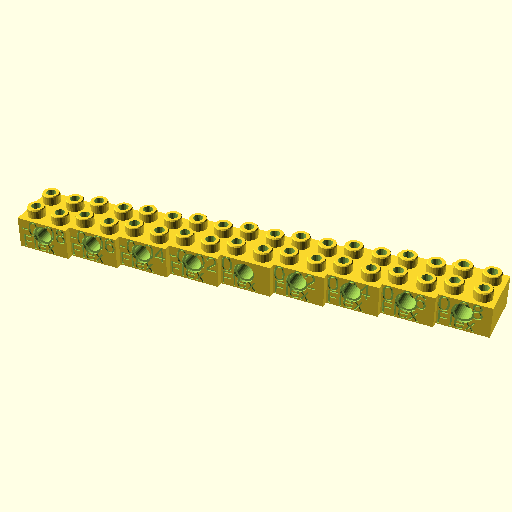](https://github.com/LEGO-compatible-gadgets/PELA-parametric-blocks-render/blob/master/PELA-calibration-flex-thin.stl)

[PELA Calibration Bar, Flexible Filament, Thin Sockets](https://github.com/LEGO-compatible-gadgets/PELA-parametric-blocks-render/blob/master/PELA-calibration-flex-thin.stl) PELA Calibration Bar for flexible filament (TPU etc) and a fine extruder (less than 0.5mm diameter- thin bottom socket walls)

___

[PELA Calibration Bar, Flexible Filament, Thick Sockets](https://github.com/LEGO-compatible-gadgets/PELA-parametric-blocks-render/blob/master/PELA-calibration-flex-thick.stl) PELA Calibration Bar for flexible filament (TPU etc) and a large extruder (0.5mm diameter or geater, or if you prefer to avoid thin walls)

___

Use either the [PELA Calibration Bar](https://github.com/LEGO-compatible-gadgets/PELA-parametric-blocks-render/blob/master/PELA-calibration.stl) or [PELA Calibration Block Set](https://github.com/LEGO-compatible-gadgets/PELA-parametric-blocks-render/blob/master/PELA-calibration-set.stl) to find the right settings for your printer setup.

**TL;DR** *: To get a nice snap fit, print `PELA-calibration.stl` and test the fit with commercial LEGO. Type the best `top_tweak` and `bottom_tweak` into [`print-style.scad`](print-style.scad). Now open any model in OpenSCAD, press `F6` then `Export as STL`.*

### Calibration Instructions

Your printer, slicer settings, and plastic effect the precise fit. To correct for this, we adjust the models slightly for your printing process. Calibration is a one time process for each material. It is as simple as fitting two blocks together and editing a text file, [`print-style.scad`](print-style.scad) to indicate which test block fits best.

Before you print the calibration bar, be sure to set the `flexible_material` and `large_nozzle` settings in [`print-style.scad`](https://github.com/PELA-Prototypes/parametric-PELA/blob/master/print-style.scad).

After you print the clibration bar, you update three settings to get a tight fit: `top_tweak`, `bottom_tweak` and `axle_hole_tweak`. These can be read from the side of the calibration bar.

1. Print the Calibration Bar and test fit the top knobs and bottom sockets against commercial LEGO. Put the `top_tweak` (on the side, near the top) and `bottom_tweak` (on the side, near the bottom) values that you can read from the side of the bar into `print-style.scad`.
1. Use OpenSCAD to generate a new 2x2x1 `PELA Block` in OpenSCAD using these new settings, press `F6` to render, and `Export` as `.STL`. Windows command line scripts are provided: `.\block.ps1 2 2 1` or `.\technic-block.ps1 2 2 1`
1. Confirm a good fit with both commercial blocks and other PELA Blocks.
1. If you find you also need to adjust the technic connector hole size, print the Calibration Block Set. `axle_hole_tweak` numbers change along with `top_tweak` numbers.
1. Repeat this process as needed when you change material, nozzle size or and slicer settings which affect geometry.

## Advanced Calibration

An alternative set of individual calibration blocks are available, and if you have an unusual material there are other numbers you can tune such as various part thicknesses. See [Advanced Calibration](ADVANCED-CALIBRATION)

## PELA-compatible Part Designs

Edit `print-style.scad` and `style.scad` to adapt these models before printing them. **The example models below are not yet calibrated for your slicer and printer. Calibrate and then make the tuned model from the .scad file.**

[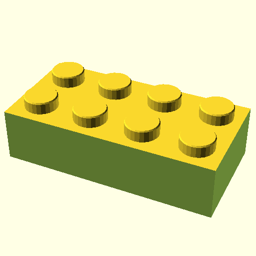](https://github.com/LEGO-compatible-gadgets/PELA-parametric-blocks-render/blob/master/PELA-block-4-2-1.stl)

[3D PELA Block](https://github.com/LEGO-compatible-gadgets/PELA-parametric-blocks-render/blob/master/PELA-block-4-2-1.stl)

___

[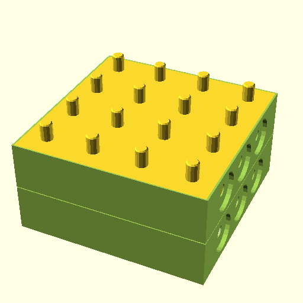](https://github.com/LEGO-compatible-gadgets/PELA-parametric-blocks-render/blob/master/PELA-technic-block-4-4-2.stl)

[3D PELA Block with technic connectors](https://github.com/LEGO-compatible-gadgets/PELA-parametric-blocks-render/blob/master/PELA-technic-block-4-4-2.stl) Optional vents help to dissipate heat. There are several types you can select from.

___

[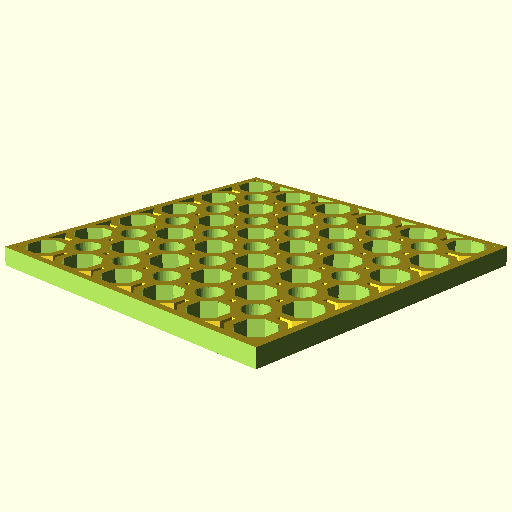](https://github.com/LEGO-compatible-gadgets/PELA-parametric-blocks-render/blob/master/PELA-socket-panel.stl)

[3D PELA Socket Panel](https://github.com/LEGO-compatible-gadgets/PELA-parametric-blocks-render/blob/master/PELA-socket-panel.stl) Insert knobs from both the top and bottom. Zoom in to see the subtle flexure ridges for enhanced "snap" fit.

___

[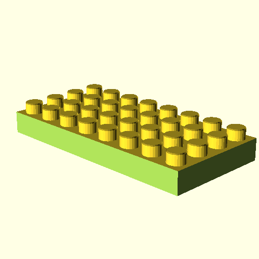](https://github.com/LEGO-compatible-gadgets/PELA-parametric-blocks-render/blob/master/PELA-knob-panel.stl)

[3D PELA Knob Panel](https://github.com/LEGO-compatible-gadgets/PELA-parametric-blocks-render/blob/master/PELA-knob-panel.stl) Optional corner holes for M3 bolts can be enabled

___

[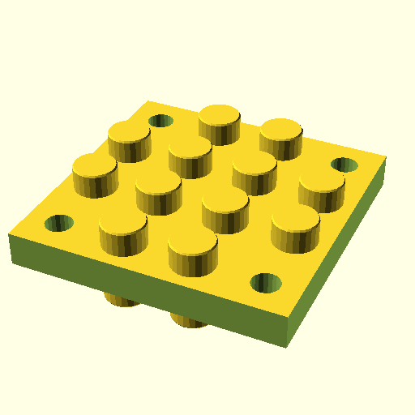](https://github.com/LEGO-compatible-gadgets/PELA-parametric-blocks-render/blob/master/PELA-double-sided-knob-panel.stl)

[3D Double-sided PELA Knob Panel](https://github.com/LEGO-compatible-gadgets/PELA-parametric-blocks-render/blob/master/PELA-double-sided-knob-panel.stl) Double sided. Enable print supports in the slicer.

___

[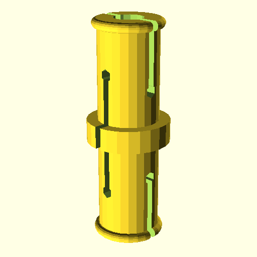](https://github.com/LEGO-compatible-gadgets/PELA-parametric-blocks-render/blob/master/PELA-technic-pin.stl)

[3D PELA Technic Pin](https://github.com/LEGO-compatible-gadgets/PELA-parametric-blocks-render/blob/master/PELA-technic-pin.stl) This is difficult to print with some material, but useful you run short and don't want to wait for mail order. It works best with slightly flexible materials.

___

[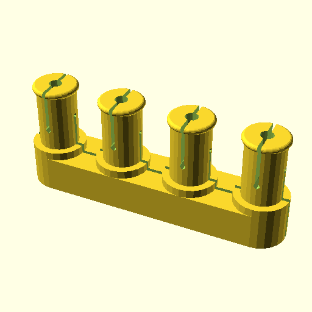](https://github.com/LEGO-compatible-gadgets/PELA-parametric-blocks-render/blob/master/PELA-technic-pin-array.stl)

[3D PELA Technic Pin Array](https://github.com/LEGO-compatible-gadgets/PELA-parametric-blocks-render/blob/master/PELA-technic-pin-array.stl) A set of technic pins for multi-point connection.

___

[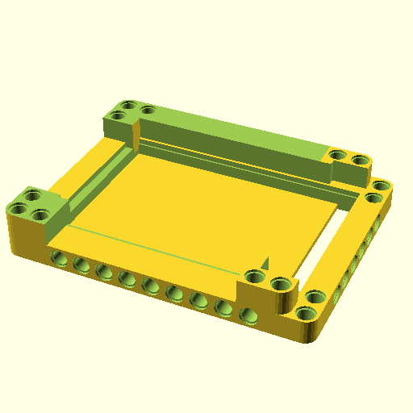](https://github.com/LEGO-compatible-gadgets/PELA-parametric-blocks-render/blob/master/PELA-raspberry-pi3-technic-mount.stl)

[3D PELA Technic Raspberry Pi 3B Mount](https://github.com/LEGO-compatible-gadgets/PELA-parametric-blocks-render/blob/master/PELA-raspberry-pi3-technic-mount.stl) A Raspberry Pi 2/3 holder.

___

[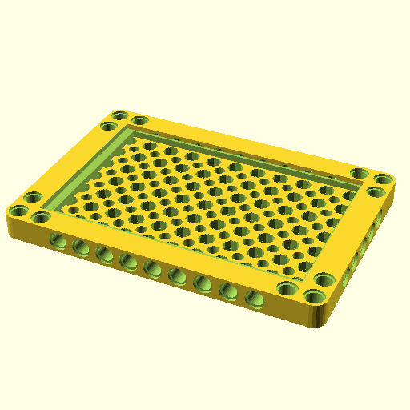](https://github.com/LEGO-compatible-gadgets/PELA-parametric-blocks-render/blob/master/PELA-raspberry-pi3-technic-cover.stl)

[3D PELA Technic Raspberry Pi 3B Cover](https://github.com/LEGO-compatible-gadgets/PELA-parametric-blocks-render/blob/master/PELA-raspberry-pi3-technic-cover.stl) A Raspberry Pi 2/3 holder optional top cover.

___

[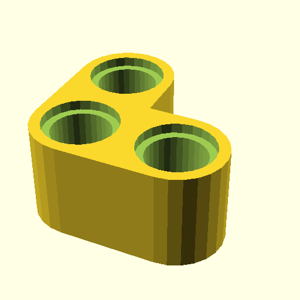](https://github.com/LEGO-compatible-gadgets/PELA-parametric-blocks-render/blob/master/PELA-raspberry-pi3-technic-corner.stl)

[3D PELA Technic Raspberry Pi 3B Corner](https://github.com/LEGO-compatible-gadgets/PELA-parametric-blocks-render/blob/master/PELA-raspberry-pi3-technic-corner.stl) An optional Raspberry Pi 2/3 technic corner to help attach the top cover.

___

[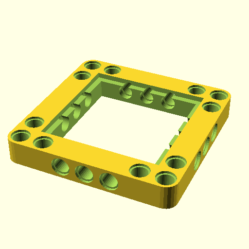](https://github.com/LEGO-compatible-gadgets/PELA-parametric-blocks-render/blob/master/PELA-raspberry-pi3-camera-technic-mount.stl)

[3D PELA Technic Pi Camera Mount](https://github.com/LEGO-compatible-gadgets/PELA-parametric-blocks-render/blob/master/PELA-raspberry-pi3-camera-technic-mount.stl) A Raspberry Pi 3 camera holder.

___

[3D PELA Technic PIR Motion Sensor Mount](https://github.com/LEGO-compatible-gadgets/PELA-parametric-blocks-render/blob/master/PELA-pir-technic-mount.stl) A PIR motion sensor holder.

___

[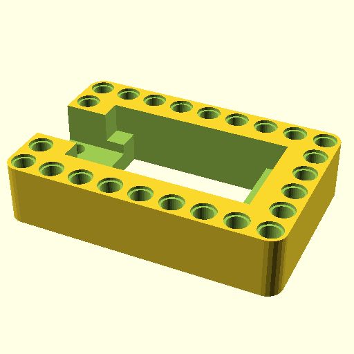](https://github.com/LEGO-compatible-gadgets/PELA-parametric-blocks-render/blob/master/PELA-technic-nodemcu-v2-knob-mount.stl)

[3D PELA Technic NodeMCU v2 Mount](https://github.com/LEGO-compatible-gadgets/PELA-parametric-blocks-render/blob/master/PELA-technic-nodemcu-v2-mount.stl) A technic mount for NodeMCU v2.

___

[3D PELA Technic Seeed Respeaker Core v2 Mount](https://github.com/LEGO-compatible-gadgets/PELA-parametric-blocks-render/blob/master/PELA-technic-respeaker-core-v2-mount.stl) A technic mount for the Respeaker Core v2 microphone array.

___

[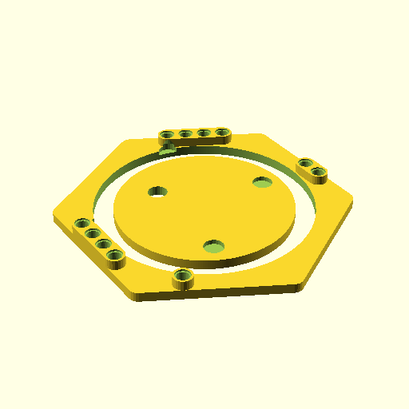](https://github.com/LEGO-compatible-gadgets/PELA-parametric-blocks-render/blob/master/PELA-technic-respeaker-core-v2-top.stl)

[3D PELA Technic Seeed Respeaker Core v2 Top](https://github.com/LEGO-compatible-gadgets/PELA-parametric-blocks-render/blob/master/PELA-technic-respeaker-core-v2-top.stl) The opaque part of the lid for the Respeaker Core v2 microphone array. Change "two_color_print=false" in "print-style.scad" or two color print this with the "clear ring" part below.

___

[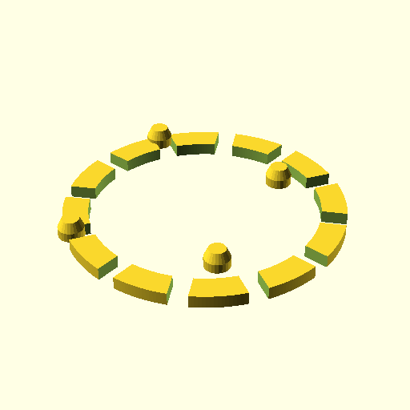](https://github.com/LEGO-compatible-gadgets/PELA-parametric-blocks-render/blob/master/PELA-technic-respeaker-core-v2-clear-ring.stl)

[3D PELA Technic Seeed Respeaker Core v2 Clear Ring](https://github.com/LEGO-compatible-gadgets/PELA-parametric-blocks-render/blob/master/PELA-technic-respeaker-core-v2-clear-ring.stl) The clear part of the top lid to for the Respeaker Core v2 microphone array. Part of a two color print with the "top" part above. In a two_color_print, the top board mounts are included in this clear material since some overlap these LED viewports.

___

[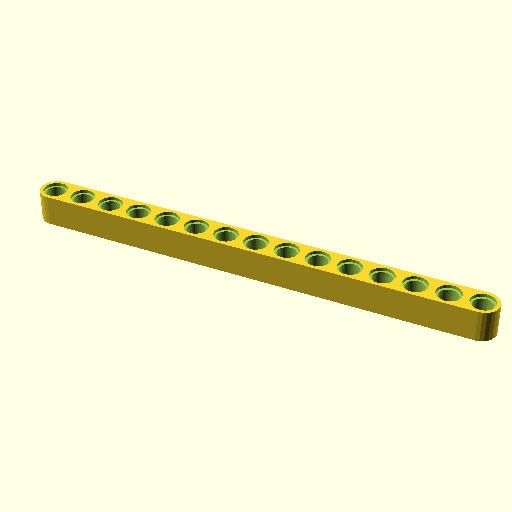](https://github.com/LEGO-compatible-gadgets/PELA-parametric-blocks-render/blob/master/PELA-technic-bar.stl)

[3D PELA Technic Bar](https://github.com/LEGO-compatible-gadgets/PELA-parametric-blocks-render/blob/master/PELA-technic-bar.stl) A minimalist technic bar.

___

[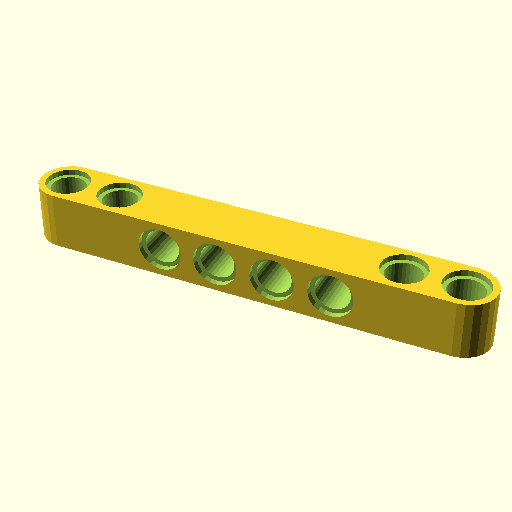](https://github.com/LEGO-compatible-gadgets/PELA-parametric-blocks-render/blob/master/PELA-technic-twist-bar.stl)

[3D PELA Technic Bar](https://github.com/LEGO-compatible-gadgets/PELA-parametric-blocks-render/blob/master/PELA-technic-twist-bar.stl) A technic bar with a center section of holes rotated 90 degrees.

___

[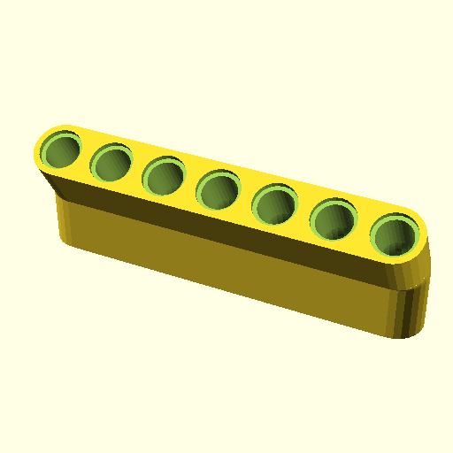](https://github.com/LEGO-compatible-gadgets/PELA-parametric-blocks-render/blob/master/PELA-technic-bar-30degree.stl)

[3D PELA Technic Bar 30 Degree](https://github.com/LEGO-compatible-gadgets/PELA-parametric-blocks-render/blob/master/PELA-technic-bar-30degree.stl) A technic bar at a 30 degree angle from a second technic bar.

___

[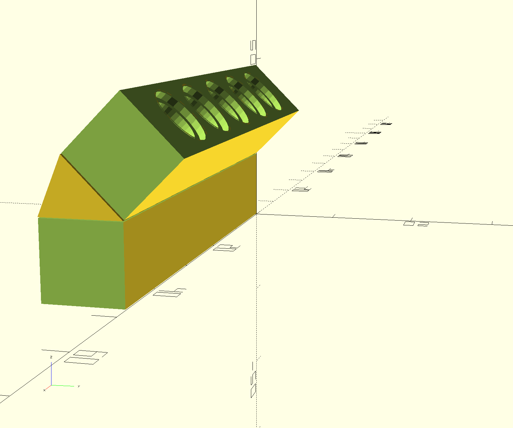](https://github.com/LEGO-compatible-gadgets/PELA-parametric-blocks-render/blob/master/PELA-technic-bar-45degree.stl)

[3D PELA Technic Bar 45 Degree](https://github.com/LEGO-compatible-gadgets/PELA-parametric-blocks-render/blob/master/PELA-technic-bar-45degree.stl) A technic bar at a 45 degree angle from a second technic bar.

___

[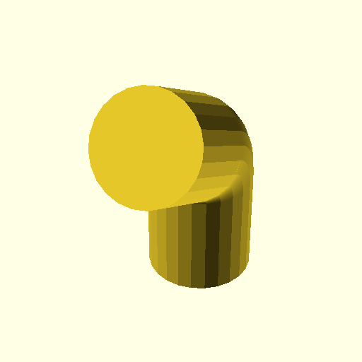](https://github.com/LEGO-compatible-gadgets/PELA-parametric-blocks-render/blob/master/PELA-technic-bar-60degree.stl)

[3D PELA Technic Bar 60 Degree](https://github.com/LEGO-compatible-gadgets/PELA-parametric-blocks-render/blob/master/PELA-technic-bar-60degree.stl) A technic bar at a 30 degree angle from a second technic bar.

___

[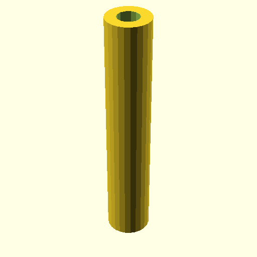](https://github.com/LEGO-compatible-gadgets/PELA-parametric-blocks-render/blob/master/PELA-technic-axle.stl)

[3D PELA Technic Axle](https://github.com/LEGO-compatible-gadgets/PELA-parametric-blocks-render/blob/master/PELA-technic-axle.stl) Rigid and flexible material shafts of adjustable length for attaching to other 3D printed designs such as wheels which you want to rotate freely.

___

[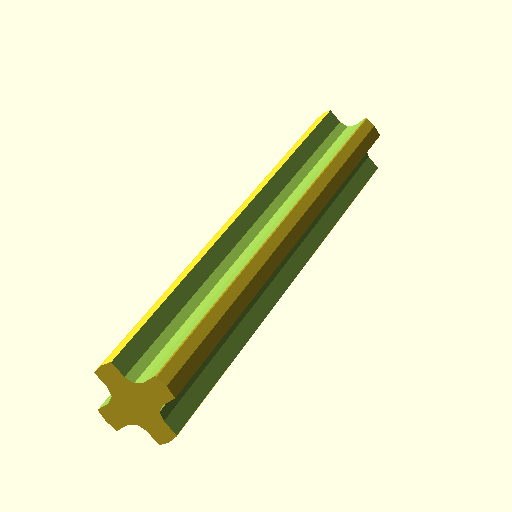](https://github.com/LEGO-compatible-gadgets/PELA-parametric-blocks-render/blob/master/PELA-technic-cross-axle.stl)

[3D PELA Technic Cross Axle](https://github.com/LEGO-compatible-gadgets/PELA-parametric-blocks-render/blob/master/PELA-technic-cross-axle.stl) Rigid and flexible material torque drive shafts for adjustable length for attaching to other 3D printed designs.

___

[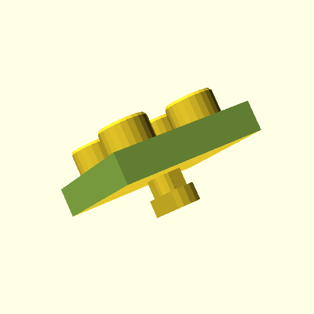](https://github.com/LEGO-compatible-gadgets/PELA-parametric-blocks-render/blob/master/PELA-openbeam15-twist-connector.stl)

[3D PELA Openbeam 15 Twist Connector](https://github.com/LEGO-compatible-gadgets/PELA-parametric-blocks-render/blob/master/PELA-openbeam15-twist-connector.stl) Insert into Openbeam 15 aluminum extrusion and twist 90 degrees to lock. This has the advantage over some other connection types that you do not need access to the ends of the beam which may require disassembly.

___

[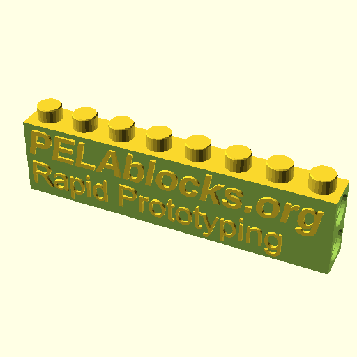](https://github.com/LEGO-compatible-gadgets/PELA-parametric-blocks-render/blob/master/PELA-sign.stl)

[3D PELA Sign](https://github.com/LEGO-compatible-gadgets/PELA-parametric-blocks-render/blob/master/PELA-sign.stl) Change the text to label your designs. Options include front and back text with either etched for raised text.

___

[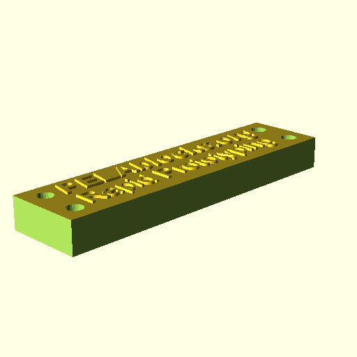](https://github.com/LEGO-compatible-gadgets/PELA-parametric-blocks-render/blob/master/PELA-panel-sign.stl)

[3D PELA Panel Sign](https://github.com/LEGO-compatible-gadgets/PELA-parametric-blocks-render/blob/master/PELA-panel-sign.stl) Change the text to label your design either edtched for raised text.

___

[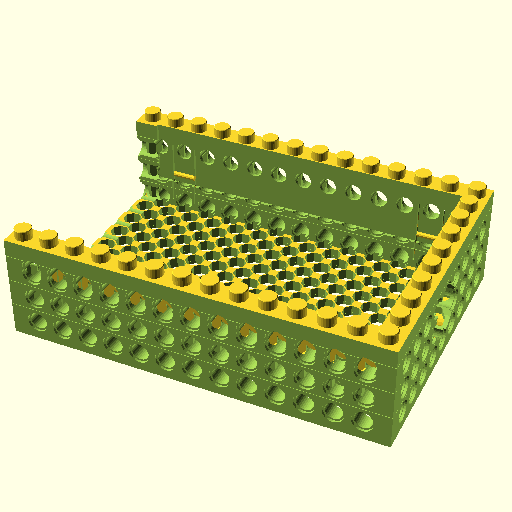](https://github.com/LEGO-compatible-gadgets/PELA-parametric-blocks-render/blob/master/PELA-stmf4discovery-box-enclosure.stl)

[3D PELA STMF4 Discovery Box Enclosure](https://github.com/LEGO-compatible-gadgets/PELA-parametric-blocks-render/blob/master/PELA-stmf4discovery-box-enclosure.stl) Enclosure for the [STMF4 Discovery](http://www.st.com/en/evaluation-tools/stm32f4discovery.html) board.

___

[3D PELA Sparkfun Pro Micro Box Enclosure](https://github.com/LEGO-compatible-gadgets/PELA-parametric-blocks-render/blob/master/PELA-sparkfun-pro-micro-box-enclosure.stl) Enclosure for the [Sparkfun Pro Micro](https://learn.sparkfun.com/tutorials/pro-micro--fio-v3-hookup-guide/introduction) board.

___

[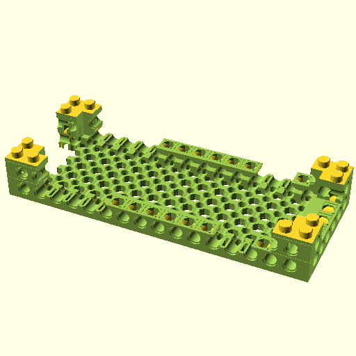](https://github.com/LEGO-compatible-gadgets/PELA-parametric-blocks-render/blob/master/PELA-intel-compute-stick-box-enclosure.stl)

[3D PELA Intel Compute Stick Box Enclosure](https://github.com/LEGO-compatible-gadgets/PELA-parametric-blocks-render/blob/master/PELA-intel-compute-stick-box-enclosure.stl) Enclosure for the [Intel Compute Stick](https://www.intel.com/content/www/us/en/products/boards-kits/compute-stick.html)

___

[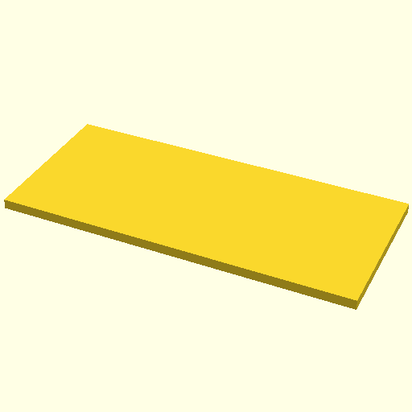](https://github.com/LEGO-compatible-gadgets/PELA-parametric-blocks-render/blob/master/PELA-intel-compute-stick-box-lid.stl)

[3D PELA Intel Compute Stick Box Lid](https://github.com/LEGO-compatible-gadgets/PELA-parametric-blocks-render/blob/master/PELA-intel-compute-stick-box-lid.stl) Enclosure cover. You may prefer a knobbed or flat panel, but ensure proper ventilation.

___

[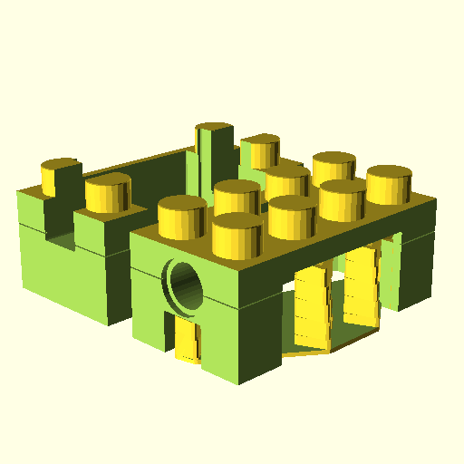](https://github.com/LEGO-compatible-gadgets/PELA-parametric-blocks-render/blob/master/PELA-grove-module-enclosure.stl)

[3D PELA Grove Module](https://github.com/LEGO-compatible-gadgets/PELA-parametric-blocks-render/blob/master/PELA-grove-module-enclosure.stl) Attach a Grove module to your build such as a plug-in electronic sensors (ultrasound, touch..) with a 4 wire plug in connector. Snap your design together with no breadboarding and no soldering!

___

[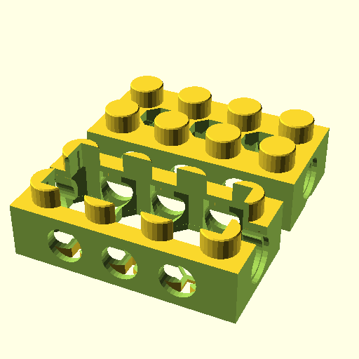](https://github.com/LEGO-compatible-gadgets/PELA-parametric-blocks-render/blob/master/PELA-n20-gearmotor-enclosure.stl)

[3D PELA N20 Gearmotor Enclosure](https://github.com/LEGO-compatible-gadgets/PELA-parametric-blocks-render/blob/master/PELA-n20-gearmotor-enclosure.stl) Add a commonly available small gear motor to your design. Adjust the model parameters to fit other motor sizes.

___

[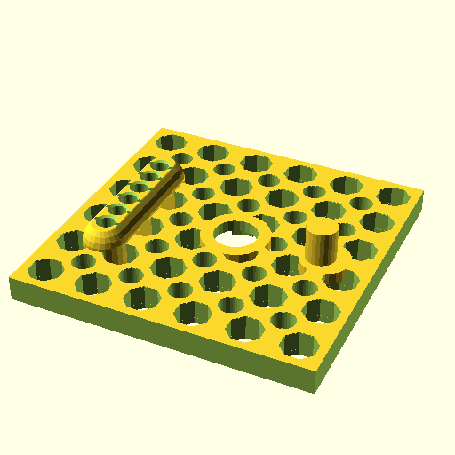](https://github.com/LEGO-compatible-gadgets/PELA-parametric-blocks-render/blob/master/PELA-vive-tracker-mount.stl)

[3D PELA HTC Vive Tracker Mount](https://github.com/LEGO-compatible-gadgets/PELA-parametric-blocks-render/blob/master/PELA-vive-tracker-mount.stl) [HTC Vive Tracker](https://www.vive.com/) attachment to your designs becomes easy to remove.

___

[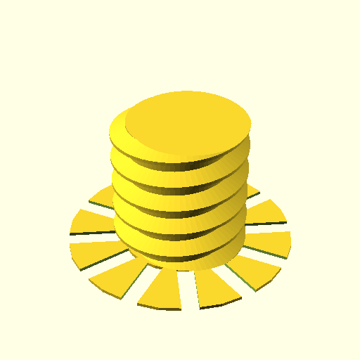](https://github.com/LEGO-compatible-gadgets/PELA-parametric-blocks-render/blob/master/PELA-vive-tracker-screw.stl)

[3D PELA HTC Vive Tracker Screw](https://github.com/LEGO-compatible-gadgets/PELA-parametric-blocks-render/blob/master/PELA-vive-tracker-screw.stl) Use this printable bolt for flush mounting the HTC Vive Tracker (above), or use a standard tripod bolt. The printed version works better than you might expect.

___

[3D PELA Velcro Mount](https://github.com/LEGO-compatible-gadgets/PELA-parametric-blocks-render/blob/master/PELA-velcro-mount.stl) For attaching using Velcro or similar straps through the bottom slot.

___

[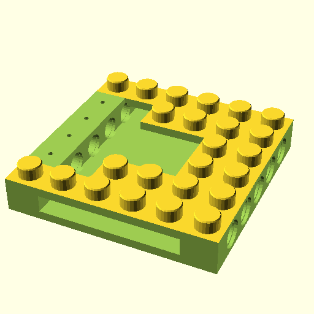](https://github.com/LEGO-compatible-gadgets/PELA-parametric-blocks-render/blob/master/PELA-vive-velcro-mount.stl)

[3D PELA Velcro Mount](https://github.com/LEGO-compatible-gadgets/PELA-parametric-blocks-render/blob/master/PELA-vive-velcro-mount.stl) For attaching the HTC Vive Tracker or other sensors using Velcro or similar straps. Use this for example to attach position sensors to your shoes.

___

[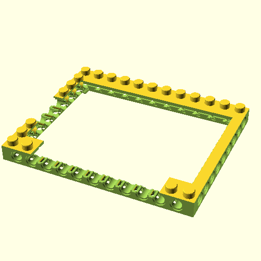](https://github.com/LEGO-compatible-gadgets/PELA-parametric-blocks-render/blob/master/PELA-raspberry-pi3-knob-mount.stl)

[3D PELA Raspberry Pi 3 Board Mount](https://github.com/LEGO-compatible-gadgets/PELA-parametric-blocks-render/blob/master/PELA-raspberry-pi3-knob-mount.stl) A base allowing snap-in holding of the board with full connector access and optional top cover

___

[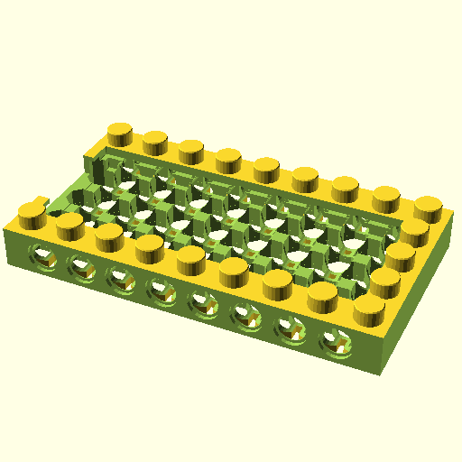](https://github.com/LEGO-compatible-gadgets/PELA-parametric-blocks-render/blob/master/PELA-pca9685-servo-knob-mount.stl)

[3D PELA PCA9685 16 Channel Servo Board Mount](https://github.com/LEGO-compatible-gadgets/PELA-parametric-blocks-render/blob/master/PELA-pca9685-servo-knob-mount.stl) For holding a servo board within a PELA block with connectors exposed at one end

___

[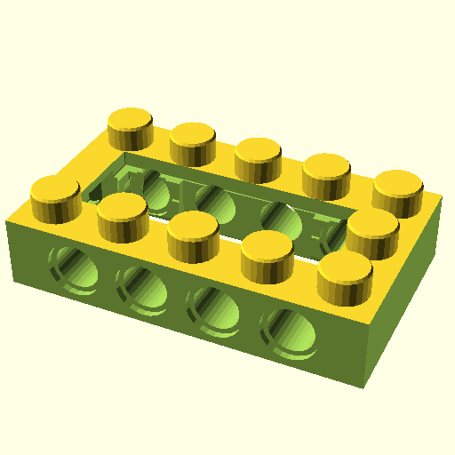](https://github.com/LEGO-compatible-gadgets/PELA-parametric-blocks-render/blob/master/PELA-nodemcu-32s-knob-mount.stl)

[3D PELA NodeMCU-32s Board Mount](https://github.com/LEGO-compatible-gadgets/PELA-parametric-blocks-render/blob/master/PELA-nodemcu-32s-knob-mount.stl) For holding an NodeMCU-32s microcontroller board within a PELA block

___

[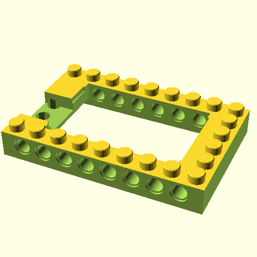](https://github.com/LEGO-compatible-gadgets/PELA-parametric-blocks-render/blob/master/PELA-nodemcu-v2-knob-mount.stl)

[3D PELA NodeMCU v2 Board Mount](https://github.com/LEGO-compatible-gadgets/PELA-parametric-blocks-render/blob/master/PELA-nodemcu-v2-knob-mount.stl) For holding an NodeMCU v2 microcontroller board within a PELA block

___

[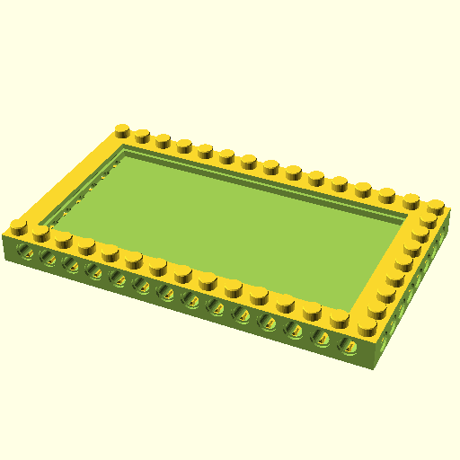](https://github.com/LEGO-compatible-gadgets/PELA-parametric-blocks-render/blob/master/PELA-arduino-mega-knob-mount.stl)

[3D PELA Arduino Mega Board Mount](https://github.com/LEGO-compatible-gadgets/PELA-parametric-blocks-render/blob/master/PELA-aruino-mega-knob-mount.stl) For holding an Arduino Mega within a PELA block

## FFF Printing Tips

* Use a 0.4mm or smaller nozzle if possible to avoid decimation of some details (inside vertical shell bars..)
* If slicing with Simplify 3D with 0.5mm or larger nozzle, you may want to set Simplify 3D to `Advanced | External Thing Wall Type | Allow single extrusion walls`
* Be aware that slicers may in some cases not be able to correct OpenSCAD STL export errors. These errors should be visible in layer preview as for example extra excursions back to origin. If this happens, open and clean the STL files first with for example Microsoft 3D Builder, Meshmixer or MeshLab. MeshLab command line examples can be found in `build.ps1`.
* Best results are achieved with durable materials that are not too stiff (PET, co-polymers like NGEN, semi-flexible and "engineering" materials instead of PLA and  carbon filled).
* Best results are achieved with smaller nozzle diameters. Adjust slicer settings for precision over speed. Layer height is not particularly important on most models.
* Think carefully before using very slippery materials such as Nylon.
* "standard" and "fast" print setting layer lines are helpful for extra connector grip provided the resulting print geometry is sufficiently accurate.
* A print "brim" the appears inside the model may negatively affect the bottom connector fit
* Leaving the blocks on a heated bed may negatively affect the bottom connector fit

## Resin Printing Tips

* If more than 2 layer tall PELA with a relatively solid interior not allowing drainage below the knobs, check if you need to expand the airhole to allow resin to drain from the flexure chamber inside each knob
* For translucent materials, setting knob_slice_count to 0 may make the interior structure look more like a standard PELA at the cost of a slight reduction of knob sidewall flex

## License

**Creative Commons Attribution-ShareAlike 4.0 International License**

These designs are by PELA project contributors, not by the LEGO corporation. They are compatible with LEGO and similar blocks available from multiple manufacturers and online projects. The associated patents have expired. These designs are not identical to LEGO; they have been specially modified for easy 3D printing and offered in the spirit of open source collaborative innovation.

If what you want is available as injection molded plastic, buy it for the higher quality and durability. These model are helpful when you want something customized, a special color, an unusual material, and for replacement parts when you just can't wait.

## Projects Using PELA Blocks

PELA has been used to create a self-driving car: 

PELA is also used to create robot parts: 

The generated 3D models displayed here are hosted in a separate GitHub project to minimize the size of pulling changes in this repo: [PELA-parametric-blocks-render](https://github.com/LEGO-compatible-gadgets/PELA-parametric-blocks-render)

## Alternative 3D Block Designs

If you don't find what you need, consider adding it, contact us or check out the many other excellent design available.

[Yeggi search for LEGO](http://www.yeggi.com/q/lego/)

[Thingiverse Parametric LEGO Group](https://www.thingiverse.com/groups/parametric-lego) are alternate source of these and other block designs.

## Contact

New models, collaboration and pull requests are welcome. You have the tools- now create something cool and share with the world : https://github.com/LEGO-compatible-gadgets/PELA-parametric-blocks

paul.houghton@futurice.com ( **[Blog](https://medium.com/@paulhoughton)** - **[Twitter](https://twitter.com/mobile_rat)**)

If you like what you see, please tweet and let others know!

