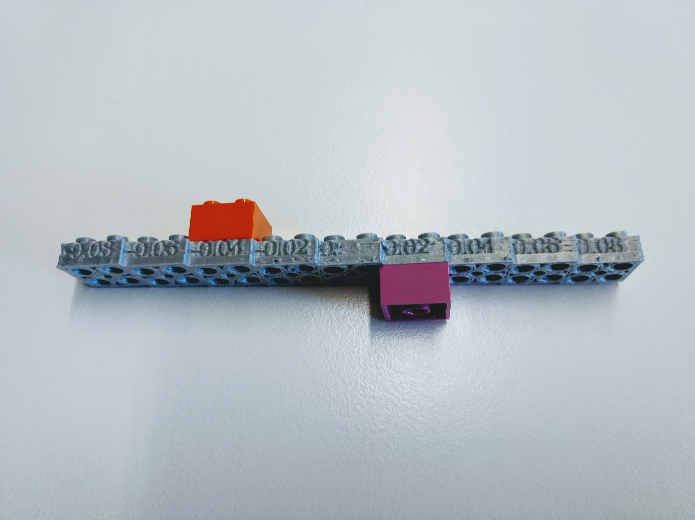
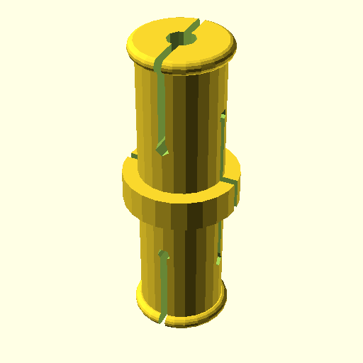
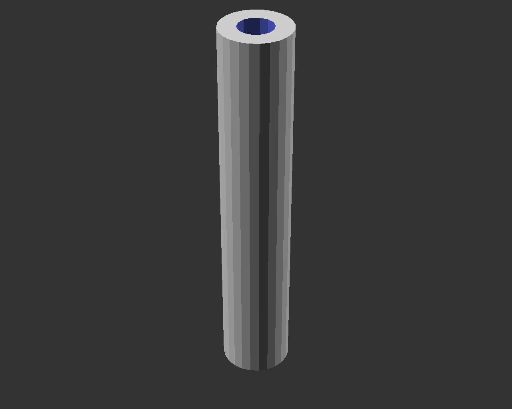
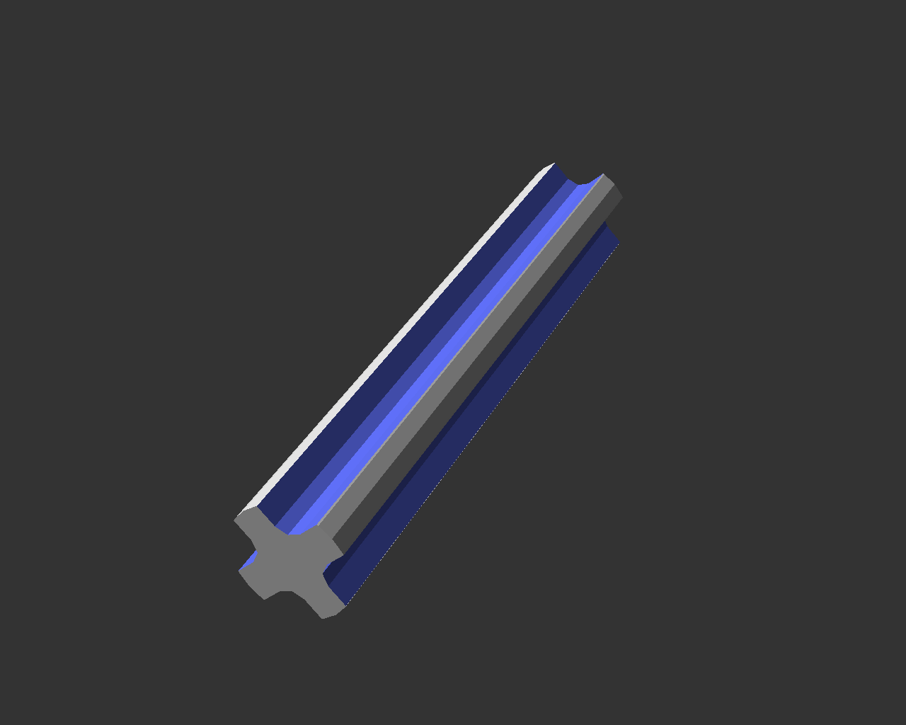
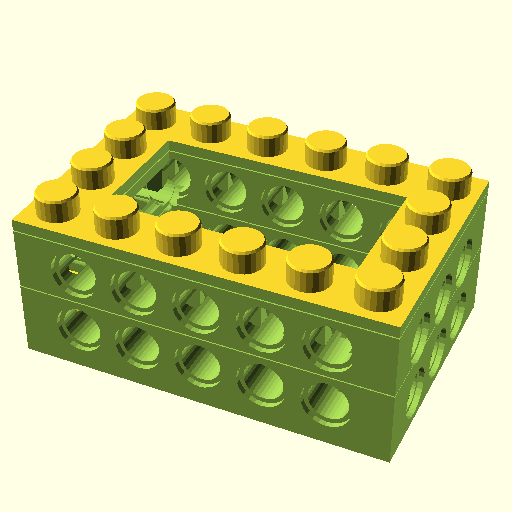

# PELA Blocks
## LEGO-compatible Parametric 3D Printed Blocks

PELA blocks are designed for easy 3D printing, strength, and rapid customization using free software. One time calibration gives perfect snap-together objects in exotic materials and geometries to help you explore your ideas and build with exotic materials and any motors and electronics you like. Example enclosures with many options for custom sensors, actuators, computers and IoT devices are included, or create your own.

These designs are not by the LEGO corporation. LEGO-compatible blocks are available from multiple manufacturers. Associated patents expired long ago in a forgotten age.

The name PELA comes from the Finnish "pelataan" meaning "let's play". **Pelataan.**

## Open source design, Powered By Futurice

These open source designs are brought to you by [Futurice](https://futurice.com) and contributions from the community. Come work with the best.

The software needed is free and open source, [OpenSCAD](http://www.openscad.org/). You can probably learn it in less than an hour.

## Download

**The STL files shown are examples only.** To get a good snap fit with your 3D print, you need to fine tune the size of top and bottom connectors. It is also easy to personalize PELA designs- start by turning on or off optional features.

1. **[DOWNLOAD](https://github.com/LEGO-compatible-gadgets/PELA-parametric-blocks/archive/master.zip)** the latest designs
1. **[Calibrate](#calibrate)** the PELA Block models for your printer

## Advanced Setup

Raytraced image generation, batch file generation and cleanup, and git lfs with sparce update are available. See [Advanced Setup](ADVANCED-SETUP)

## Slicer Recommendations

See the [slicer recommendations](SLICER_RECOMMENDATIONS) for material information and settings.

## Calibrate

[3D PELA Calibration Bar](https://github.com/LEGO-compatible-gadgets/PELA-parametric-blocks/blob/master/calibration/PELA-calibration.stl)

These parametric models are easily tuned for a perfect snap fit with almost any plastic and printer.

**TL;DR** *: To get a nice snap fit, print `PELA-calibration.stl` and test the fit with commercial LEGO. Type the best `top_tweak` and `bottom_tweak` into [`PELA-print-parameters.scad`](PELA-print-parameters.scad). Now open any model in OpenSCAD, press `F6` then `Export as STL`.*

### Calibraton Instructions

Your printer, slider and plastic effect the precise fit of press fit connectors. To correct for this we adjust the models slightly. It is a one time process for each material. It is as simple as fitting two blocks together and editing a text file, [`PELA-print-parameters.scad`](PELA-print-parameters.scad), with your preferred fit.

The most common settings are `top_tweak` and `bottom_tweak`. These can be read from the side of the clibration bar. 

Be sure to set the `flexible_material` and `large_nozzle` settings in [`PELA-print-parameters.scad`](https://github.com/PELA-Prototypes/parametric-PELA/blob/master/PELA-print-parameters.scad). These help to tailor the models for easier printing and a better fit.

1. Print the Calibration Bar and test fit the top knobs and bottom sockets against commercial LEGO. Put the `top_tweak` (on the side, near the top) and `bottom_tweak` (on the side, near the bottom) values that you can read from the side of the bar into `print-parameters.scad`.
1. Use OpenSCAD to open Generate a new 2x2x1 `PELA Block` in OpenSCAD using these new settings, press `F6` to render, and export as `.STL`. Windows command line scripts are provided: `.\PELA-block.ps1 2 2 1` or `.\PELA-technic-block.ps1 2 2 1`
1. Confirm a good fit with both commercial blocks and other PELA Blocks.
1. If you find you also need to adjust the technic connector hole size, print the Calibration Block Set. `axle_hole_tweak` numbers change along with `top_tweak` numbers.
1. Repeat this process as needed when you change material, nozzle size or and slicer settings.

## Advanced Calibration

An alternative set of individual calibration blocks with technic holes are available. See [Advanced Calibration](ADVANCED-CALIBRATION)

## PELA-compatible Part Designs

Edit `PELA-print-parameters.scad` and `PELA-parameters.scad` to adapt these models before printing them. **The example models below are not yet calibrated for your slicer and printer. Calibrate and then make the tuned model from the .scad file.**

[3D PELA Block](https://github.com/LEGO-compatible-gadgets/PELA-parametric-blocks/blob/master/PELA-block-4-2-1.stl) 

[3D PELA Block with technic connectors](https://github.com/LEGO-compatible-gadgets/PELA-parametric-blocks/blob/master/PELA-technic-block-4-4-2.stl) (optional vents to help dissipate heat)

[3D PELA Socket Panel](https://github.com/LEGO-compatible-gadgets/PELA-parametric-blocks/blob/master/socket-panel/PELA-socket-panel.stl) (double-sided)

[3D PELA Knob Panel](https://github.com/LEGO-compatible-gadgets/PELA-parametric-blocks/blob/master/knob-panel/PELA-knob-panel.stl) (optional M3 corner mount bolt holes as with other models)

[3D Double-sided PELA Knob Panel](https://github.com/LEGO-compatible-gadgets/PELA-parametric-blocks/blob/master/knob-panel/PELA-double-sided-knob-panel.stl)

[3D PELA Technic Pin](https://github.com/LEGO-compatible-gadgets/PELA-parametric-blocks/blob/master/pin/PELA-technic-pin.stl) (in case you run short and don't want to wait for mail order)

[3D PELA Technic Axle](https://github.com/LEGO-compatible-gadgets/PELA-parametric-blocks/blob/master/axle/PELA-technic-axle.stl) (adjustable lenth)

[3D PELA Technic Cross Axle](https://github.com/LEGO-compatible-gadgets/PELA-parametric-blocks/blob/master/axle/PELA-technic-cross-axle.stl) (rigid and flexible drive shafts)

[3D PELA Sign](https://github.com/LEGO-compatible-gadgets/PELA-parametric-blocks/blob/master/sign/PELA-sign.stl) (label your designs, optionally etch text into the surface)

[3D PELA Panel Sign](https://github.com/LEGO-compatible-gadgets/PELA-parametric-blocks/blob/master/sign/PELA-panel-sign.stl) (corner bolt holes are optional on most models)

[3D PELA Box Enclosure](https://github.com/LEGO-compatible-gadgets/PELA-parametric-blocks/blob/master/box-enclosure/PELA-box-enclosure.stl) (use a panel for a lid; modify with access holes and mounts for internal componets)

[3D PELA Grove Module](https://github.com/LEGO-compatible-gadgets/PELA-parametric-blocks/blob/master/grove-module-enclosure/PELA-grove-module-enclosure.stl) (use 4x M3 bolts to assemble or switch to pressure fit)

[3D PELA Motor Enclosure](https://github.com/LEGO-compatible-gadgets/PELA-parametric-blocks/blob/master/motor-enclosure/PELA-motor-enclosure.stl) (adjust parameters for different motor sizes)

[3D PELA HTC Vive Tracker Mount](https://github.com/LEGO-compatible-gadgets/PELA-parametric-blocks/blob/master/vive-tracker-mount/PELA-vive-tracker-mount.stl) (for [HTC Vive](https://www.vive.com/), use a standard tripod screw if you prefer)

[3D PELA HTC Vive Tracker Screw](https://github.com/LEGO-compatible-gadgets/PELA-parametric-blocks/blob/master/vive-tracker-mount/PELA-vive-tracker-screw.stl) (a standard tripod screw sized for flush mounting in a PELA panel)

[3D PELA Rail Mount](https://github.com/LEGO-compatible-gadgets/PELA-parametric-blocks/blob/master/rail-mount/PELA-rail-mount.stl) (for placing HTC Vive Tracker or other sensors on a real gun rail)

 (alternative design to attach to rectangular ribs)

[3D PELA Rib Mount](https://github.com/LEGO-compatible-gadgets/PELA-parametric-blocks/blob/master/rail-mount/PELA-rib-mount.stl) (alternative attachment to a recangular rail)

[3D PELA Endcap Enclosure](https://github.com/LEGO-compatible-gadgets/PELA-parametric-blocks/blob/master/endcap-enclosure/PELA-endcap-enclosure.stl) (adjust the parameters to fit around something)

[3D PELA Intel Compute Stick Enclosure](https://github.com/LEGO-compatible-gadgets/PELA-parametric-blocks/blob/master/endcap-enclosure/PELA-endcap-intel-compute-stick-enclosure.stl) (a computer inside your robot)

[3D PELA Anker USB Hub Enclosure](https://github.com/LEGO-compatible-gadgets/PELA-parametric-blocks/blob/master/endcap-enclosure/PELA-endcap-anker-usb-hub-enclosure.stl) (a USB hub computer inside your robot)

[3D Print Support](https://github.com/LEGO-compatible-gadgets/PELA-parametric-blocks/blob/master/support/support.stl) (parametric internal print-time roof and overhang support explicitly placed in your model for precise control and limited side effects vs autogenerated slicer supports)

Collaboration and pull requests are welcome: https://github.com/LEGO-compatible-gadgets/PELA-parametric-blocks

## FFF Printing Tips

* Use a 0.4mm or smaller nozzle if possible to avoid decimation of some details (inside vertical shell bars..)
* If slicing with Simplify 3D with 0.5mm or larger nozzle, either expand the ring_thickness (and risk stiff bottom connectors) or set `Advanced | External Thing Wall Type | Allow single extrusion walls`
* Be aware that slicers may in some cases not be able to correct OpenSCAD STL export errors. These errors should be visible in layer preview as for example extra excursions back to origin. If this happens, open and clean the STL files first with for example Windows 3D Builder, Meshmixer or Meshlab. Meshlab command line examples can be found in `build.ps1`. 
* Best results are achieved with durable materials that are not too stiff (PET, co-oplimers like NGEN, semi-flexible and "engineering" materials instead of PLA and  carbon filled).
* Best results are achieved with smaller nozzle diameters. Adjust slicer settings for precision over speed. Layer height is not particularly important on most models.
* Think carefully before using very slippery materials such as Nylon.
* "standard" and "fast" print setting layer lines are helpful for extra connector grip provided the resulting print geometry is sufficiently accurate.
* A print "brim" the appears inside the model may negatively affect the bottom connector fit
* Leaving the blocks on a heated bed may negatively affect the bottom connector fit

## Resin Printing Tips

* If more than 2 layer tall PELA with a relatively solid interior not allowing drainage below the knobs, check if you need to expand the airhole to allow resin to drain from the flexture chamber inside each knob
* For translucent materials, setting knob_slice_count to 0 may make the interior structure look more like a standard PELA at the cost of a slight reduction of knob sidewall flex

## License

**Creative Commons Attribution-ShareAlike 4.0 International License**

These designs are by PELA project contributors, not by the LEGO corporation. They are compatible with LEGO and similar blocks available from multiple manufacturers and online projects. The associated patents have expired. These designs are not identical to LEGO; they have been specially modified for easy 3D printing and offered in the spirit of open source collaborative innovation.

If what you want is available as injection moulded plastic, buy it for the higher quality and durability. These model are helpful when you want something customized, a special color, an unusual material, and for replacement parts when you just can't wait.

## Projects Using PELA Blocks

Robotics work in progress: [3D Printed LEGO-compatible Parametric Robot Hand](http://robothand.pelablocks.org)

## Alternative 3D Block Designs

If you don't find what you need, consider adding it, contact us or check out the many other excellent design available.

[Yeggi search for LEGO](http://www.yeggi.com/q/lego/)

[Thingiverse Parametric LEGO Group](https://www.thingiverse.com/groups/parametric-lego) are alternate source of these and other block designs.

## Contact

Collaboration and pull requests are welcome!

paul.houghton@futurice.com ( **[Blog](https://medium.com/@paulhoughton)** - **[Twitter](https://twitter.com/mobile_rat)**)

If you like what you see, please let others know!

