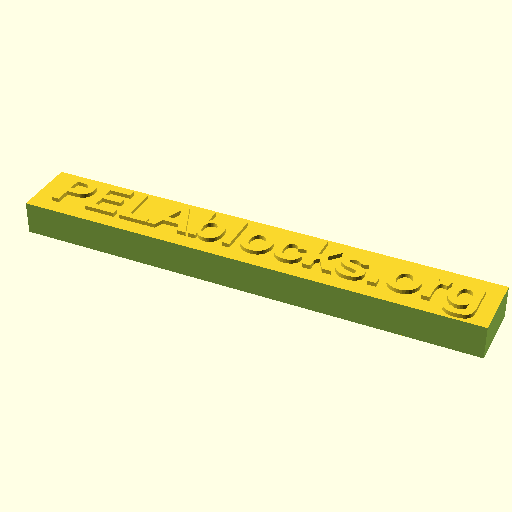
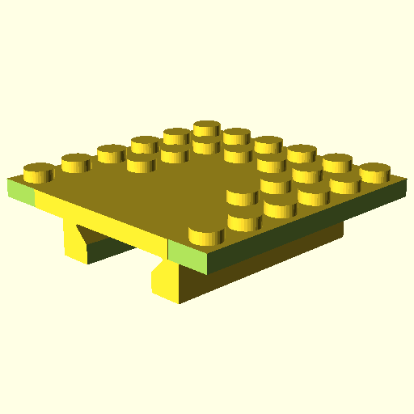
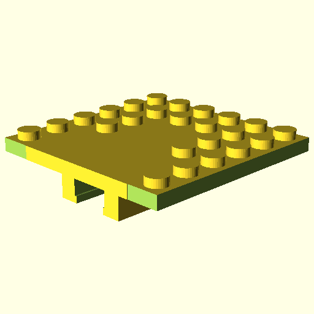

# PELA Blocks
## Parametric 3D Printed LEGO-compatible Blocks

3D print snap-together objects in exotic materials and geometries. This can be used to make exotic-shapes and materials. It is also great for creating enclosures for sensors, actuators, computers and IoT devices with commercial PELA and PELA Technics parts. Fully parametric fine-tuning parameters and calibration allow for a perfect fit with different materials, printers, nozzle sizes and slicer settings.

These designs are not by the LEGO corporation. They are compatible with LEGO and similar blocks available from multiple manufacturers. These design are legal to use because the associated patents have expired. These designs are not identical to LEGO. They are specially modified for easy 3D printing and offered in the spirit of open source hardware innovation. If what you want is available as injection moulded ABS plastic, buy it for the high quality and durability. These model are helpful if you want something customized and special, or in an unusual material or for a quick replacement part.

The name PELA comes from the Finnish "pelataan" meaning "let's play".

Pelataan.

## Sponsor

Special thanks to [Futurice](http://futurice.com) for sponsoring this design work. Futurice supports truly open innovation.

## Download or Clone

1. **[DOWNLOAD](https://github.com/LEGO-Prototypes/PELA-parametric-blocks/archive/master.zip)** the latest designs and edit with [OpenSCAD](http://www.openscad.org/).
1. Or you can `git clone git@github.com:LEGO-Prototypes/PELA-parametric-blocks.git` 
1. Setup your printer for geometric precision. [Slicer Recommendations](slicer_recommendations.md) contains some suggestions.
1. **IMPORTANT:** First calibrate the PELA Blocks for your printer to achieve a nice snap fit (below)

These designs are too complex to reliably use the Thingiverse online customizer.

## Advanced Setup (adds raytraced image generation)
1. Install Python 3
1. Install PovRay
1. `git clone --recursive git@github.com:LEGO-Prototypes/PELA-parametric-blocks.git` 
1. `cd stltools`
1. `python .\setup.py build`
1. `python .\setup.py install`
1. Calibrate for your printer (below)
1. `make.ps1 -clean -jpg`

## Calibration

[3D PELA Calibration Bar](https://github.com/LEGO-Prototypes/PELA-parametric-blocks/blob/master/calibration/PELA-calibration.stl)

[3D PELA Calibration Block Set](https://github.com/LEGO-Prototypes/PELA-parametric-blocks/blob/master/calibration/PELA-calibration-set.stl)

**TL;DR** *: Print either a Calibration Bar or Calibration Block Set, test fit with LEGO and read the best 'top_tweak' and 'bottom_tweak' numbers from the block side from the block sides, then update these numbers in [`print-parameters.scad`](https://github.com/PELA-Prototypes/parametric-PELA/blob/master/print-parameters.scad). Now open any model in OpenSCAD, press F6, and `Export as STL` to create the model optimized for your printer.*

Printer, slider parameters and plastic effect the precise fit of press fit connectors. It is usually necessary to slightly adjust knob and bottom ring size to achieve a good fit by editing [`PELA-print-parameters.scad`](https://github.com/PELA-Prototypes/parametric-PELA/blob/master/PELA-print-parameters.scad). The most common settings are `top_tweak` and `bottom_tweak` which can be read from the side of the clibration block. Other model settings affecting all designs are available in [`PELA-parameters.scad`](https://github.com/PELA-Prototypes/parametric-PELA/blob/master/PELA-parameters.scad). The `PELA-calibreation-set` blocks vary the size of `axle_hole_tweak`. Read the same `top_tweak` number from the side, nearer the top of the block.

Be sure to set the `flexible_material` and `large_nozzle` settings in [`PELA-print-parameters.scad`](https://github.com/PELA-Prototypes/parametric-PELA/blob/master/PELA-print-parameters.scad). These help to tailor the models for easier printing and a better fit.

1. Print the Calibration Bar and test fit the top knobs and bottom sockets against commercial LEGO. Put the `top_tweak` (on the side, near the top) and `bottom_tweak` (on the side, near the bottom) values that you can read from the side of the bar into `print-parameters.scad`.
1. Generate a new 2x2x1 `PELA Block` in OpenSCAD using these new settings, press F6 to render, and export as `.STL`. In Windows, you can do with from the command line: `.\PELA-block.ps1 2 2 1` or `.\PELA-technic-block.ps1 2 2 1`
1. Confirm a good fit with both commercial LEGO and other PELA Blocks.
1. If you find you also need to adjust the Technics connector hole size, print the Calibration Block Set. `axle_hole_tweak` numbers change along with `top_tweak` numbers.
1. Repeat this process as needed when you change material, nozzle size or and slicer settings.

## Backing Up Your Calibration Files

If you later update the PELA-blocks project to a newer version, you risk overwirting and loosing your calibration customizations. The simplest solution is to create a backup copy those settings.

1. `cd PELA-Blocks`
1. `cp PELA-parameters.scad ../PELA-parameters-backup.scad`
1. `cp PELA-print-parameters.scad ../PELA-print-parameters-backup.scad`

## PELA-compatible Part Designs

Edit `PELA-print-parameters.scad` and `PELA-parameters.scad` to adapt these models before printing them. The example renders are for a Taz 6, 0.5mm nozzle, NGEN rigid filament, LulzBot Cura standard slicer settings.

[3D PELA Block](https://github.com/LEGO-Prototypes/PELA-parametric-blocks/blob/master/PELA-block-4-2-1.stl) 

[3D PELA Block with Technics connectors](https://github.com/LEGO-Prototypes/PELA-parametric-blocks/blob/master/PELA-technic-block-4-4-2.stl) (optional vents to help dissipate heat)

[3D PELA Socket Panel](https://github.com/LEGO-Prototypes/PELA-parametric-blocks/blob/master/socket-panel/PELA-socket-panel.stl) (double-sided)

[3D PELA Knob Panel](https://github.com/LEGO-Prototypes/PELA-parametric-blocks/blob/master/knob-panel/PELA-knob-panel.stl) (optional M3 corner mount bolt holes as with other models)

[3D Double-sided PELA Knob Panel](https://github.com/LEGO-Prototypes/PELA-parametric-blocks/blob/master/knob-panel/PELA-double-sided-knob-panel.stl)

[3D PELA Technic Pin](https://github.com/LEGO-Prototypes/PELA-parametric-blocks/blob/master/PELA-technic-pin.stl) (in case you run short and don't want to wait for mail order)

[3D PELA Technic Axle](https://github.com/LEGO-Prototypes/PELA-parametric-blocks/blob/master/PELA-technic-axle.stl) (adjustable lenth)

[3D PELA Technic Cross Axle](https://github.com/LEGO-Prototypes/PELA-parametric-blocks/blob/master/PELA-technic-cross-axle.stl) (rigid and flexible drive shafts)

[3D PELA Sign](https://github.com/LEGO-Prototypes/PELA-parametric-blocks/blob/master/sign/PELA-sign.stl) (label your designs, optionally etch text into the surface)

[3D PELA Panel Sign](https://github.com/LEGO-Prototypes/PELA-parametric-blocks/blob/master/sign/PELA-panel-sign.stl) (corner bolt holes are optional on most models)

[3D PELA Grove Module](https://github.com/LEGO-Prototypes/PELA-parametric-blocks/blob/master/grove-module-enclosure/PELA-grove-module-enclosure.stl) (use 4x M3 bolts to assemble or switch to pressure fit)

[3D PELA Motor Enclosure](https://github.com/LEGO-Prototypes/PELA-parametric-blocks/blob/master/motor-enclosure/PELA-motor-enclosure.stl) (adjust parameters for different motor sizes)

[3D PELA HTC Vive Tracker Mount](https://github.com/LEGO-Prototypes/PELA-parametric-blocks/blob/master/vive-tracker-mount/PELA-vive-tracker-mount.stl) (for [HTC Vive](https://www.vive.com/), use a standard tripod screw if you prefer)

[3D PELA HTC Vive Tracker Screw](https://github.com/LEGO-Prototypes/PELA-parametric-blocks/blob/master/vive-tracker-mount/PELA-vive-tracker-screw.stl) (a standard tripod screw sized for flush mounting in a PELA panel)

[3D PELA Gunrail Mount](https://github.com/LEGO-Prototypes/PELA-parametric-blocks/blob/master/gunrail-mount/PELA-gunrail-mount.stl) (for placing HTC Vive Tracker or other sensors on a real gun)

[3D PELA Gunrib Mount](https://github.com/LEGO-Prototypes/PELA-parametric-blocks/blob/master/gunrail-mount/PELA-gunrib-mount.stl) (alternative attachment when there is no accessory rail on the gun)

[3D PELA Endcap Enclosure](https://github.com/LEGO-Prototypes/PELA-parametric-blocks/blob/master/endcap-enclosure/PELA-endcap-enclosure.stl) (adjust the parameters to fit around something)

[3D PELA Intel Compute Stick Enclosure](https://github.com/LEGO-Prototypes/PELA-parametric-blocks/blob/master/endcap-enclosure/PELA-endcap-intel-compute-stick-enclosure.stl) (a computer inside your robot)

[3D Print Support](https://github.com/LEGO-Prototypes/PELA-parametric-blocks/blob/master/support/support.stl) (optional parametric internal support of overhangs explicitly placed in your model- more precisely controlled results and limited side effects than autogenerated slicer supports)

Collaboration and pull requests are welcome: https://github.com/LEGO-Prototypes/PELA-parametric-blocks

## FFF Printing Tips

* Use a 0.4mm or smaller nozzle if possible to avoid decimation of some details (inside vertical shell bars..)
* If slicing with Simplify 3D with 0.5mm or larger nozzle, either expand the ring_thickness (and risk stiff bottom connectors) or set Advanced | External Thing Wall Type | Allow single extrusion walls
* Be aware that Cura Engine may in some cases not be able to correct OpenSCAD STL export errors. These errors should be visible in layer preview as for example extra excursions back to origin. If this happens, open and clean the STL files first (Windows 3D Builder, Meshmixer, Meshlab..).
* Best results are achieved with durable materials that are not too stiff (PET, co-oplimers like NGEN, semi-flexible and "engineering" materials instead of PLA and  carbon filled).
* Best results are achieved with smaller nozzle diameters. Adjust slicer settings for precision over speed. Layer height is not particularly important on most models.
* Think carefully before using very slippery materials such as Nylon.
* "standard" and "fast" print setting layer lines are helpful for extra connector grip provided the resulting print geometry is sufficiently accurate.
* A print "brim" the appears inside the model may negatively affect the bottom connector fit
* Leaving the blocks on a heated bed may negatively affect the bottom connector fit

## Resin Printing Tips

* If more than 2 layer tall PELA with a relatively solid interior not allowing drainage below the knobs, check if you need to expand the airhole to allow resin to drain from the flexture chamber inside each knob
* For translucent materials, setting knob_slice_count to 0 may make the interior structure look more like a standard PELA at the cost of a slight reduction of knob sidewall flex

## License

Creative Commons Attribution ShareAlike NonCommercial License
https://creativecommons.org/licenses/by-sa/4.0/legalcode

These designs are not by the LEGO corporation. They are compatible with LEGO and similar blocks available from multiple manufacturers and online projects. The associated patents have expired. These designs are not identical to LEGO; they have been specially modified for easy 3D printing and offered in the spirit of open source collaborative innovation.

If what you want is available as injection moulded plastic, buy it for the higher quality and durability. These model are helpful when you want something customized, a special color, an unusual material, and for replacement parts when you just can't wait.

## Alternative 3D Block Designs

If you don't find what you need, consider adding it, contact us or check out the many other excellent design available.

[Yeggi search for LEGO](http://www.yeggi.com/q/lego/)

[Thingiverse Parametric LEGO Group](https://www.thingiverse.com/groups/parametric-lego) are alternate sourcse of these and other block designs.

## Contact

paul.houghton@futurice.com ( **[Blog](https://medium.com/@paulhoughton)** - **[Twitter](https://twitter.com/mobile_rat)**)
