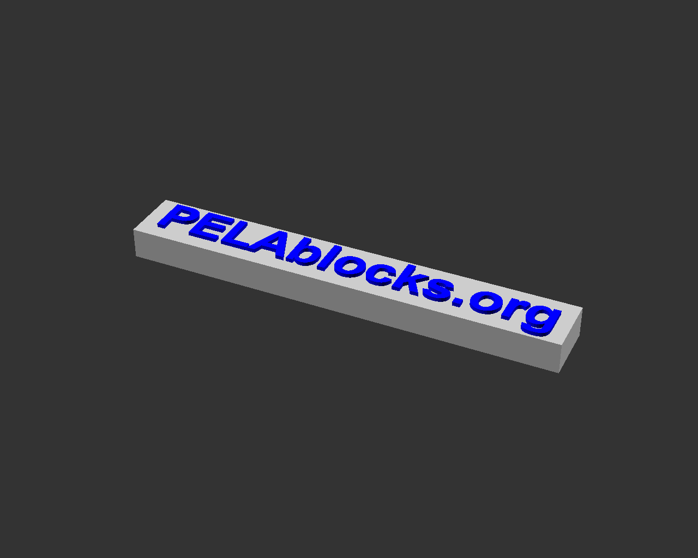

# PELA Blocks
## LEGO-compatible Parametric 3D Printed Blocks

PELA blocks are designed for easy 3D printing, strength, and rapid customization using free software. One time calibration gives perfect snap-together objects in exotic materials and geometries to help you explore your ideas and build with exotic materials and any motors and electronics you like. Example enclosures with many options for custom sensors, actuators, computers and IoT devices are included, or create your own.

These designs are not by the LEGO corporation. LEGO-compatible blocks are available from multiple manufacturers. Associated patents expired long ago in a forgotten age.

The name PELA comes from the Finnish "pelataan" meaning "let's play". **Pelataan.**

## Open source design, Powered By Futurice

These open source designs are brought to you by [Futurice](https://futurice.com) and contributions from the community. Come work with the best.

The software needed is free and open source, [OpenSCAD](http://www.openscad.org/). You can probably learn it in less than an hour.

## Download

**The STL files shown are examples only.** To get a good snap fit with your 3D print, you need to fine tune the size of top and bottom connectors. It is also easy to personalize PELA designs- start by turning on or off optional features.

1. **[DOWNLOAD](https://github.com/LEGO-compatible-gadgets/PELA-parametric-blocks/archive/master.zip)** the latest designs or `git lfs install` and `git clone git@github.com:LEGO-Prototypes/PELA-parametric-blocks.git`
1. **[Calibrate](#calibrate)** the PELA Block models for your material and printer

## Advanced Setup

See [Advanced Setup](ADVANCED-SETUP.md) for additional tricks sparse update to save you space and bandwidth, Raytraced image generation, command line STL cleanup and and batch file generation of all models when you change filaments.

## Slicer Recommendations

See the [Slicer Recommendations](SLICER-RECOMMENDATIONS.md) for settings recommendations and material information.

## Calibrate

[3D PELA Calibration Bar](https://github.com/LEGO-compatible-gadgets/PELA-parametric-blocks/blob/master/calibration/PELA-calibration.stl)

These parametric models are easily tuned for a perfect snap fit with almost any plastic and printer.

**TL;DR** *: To get a nice snap fit, print `PELA-calibration.stl` and test the fit with commercial LEGO. Type the best `top_tweak` and `bottom_tweak` into [`PELA-print-parameters.scad`](PELA-print-parameters.scad). Now open any model in OpenSCAD, press `F6` then `Export as STL`.*

### Calibraton Instructions

Your printer, slider and plastic effect the precise fit of press fit connectors. To correct for this we adjust the models slightly. It is a one time process for each material. It is as simple as fitting two blocks together and editing a text file, [`PELA-print-parameters.scad`](PELA-print-parameters.scad), with your preferred fit.

The most common settings are `top_tweak` and `bottom_tweak`. These can be read from the side of the clibration bar. 

Be sure to set the `flexible_material` and `large_nozzle` settings in [`PELA-print-parameters.scad`](https://github.com/PELA-Prototypes/parametric-PELA/blob/master/PELA-print-parameters.scad). These help to tailor the models for easier printing and a better fit.

1. Print the Calibration Bar and test fit the top knobs and bottom sockets against commercial LEGO. Put the `top_tweak` (on the side, near the top) and `bottom_tweak` (on the side, near the bottom) values that you can read from the side of the bar into `print-parameters.scad`.
1. Use OpenSCAD to open Generate a new 2x2x1 `PELA Block` in OpenSCAD using these new settings, press `F6` to render, and export as `.STL`. Windows command line scripts are provided: `.\PELA-block.ps1 2 2 1` or `.\PELA-technic-block.ps1 2 2 1`
1. Confirm a good fit with both commercial blocks and other PELA Blocks.
1. If you find you also need to adjust the technic connector hole size, print the Calibration Block Set. `axle_hole_tweak` numbers change along with `top_tweak` numbers.
1. Repeat this process as needed when you change material, nozzle size or and slicer settings.

## Advanced Calibration

An alternative set of individual calibration blocks are available. See [Advanced Calibration](ADVANCED-CALIBRATION)

## PELA-compatible Part Designs

Edit `PELA-print-parameters.scad` and `PELA-parameters.scad` to adapt these models before printing them. **The example models below are not yet calibrated for your slicer and printer. Calibrate and then make the tuned model from the .scad file.**

[3D PELA Block](https://github.com/LEGO-compatible-gadgets/PELA-parametric-blocks/blob/master/PELA-block-4-2-1.stl) 

___

[3D PELA Block with technic connectors](https://github.com/LEGO-compatible-gadgets/PELA-parametric-blocks/blob/master/PELA-technic-block-4-4-2.stl) Optional vents help to dissipate heat. There are several types you can select from.

___

[3D PELA Socket Panel](https://github.com/LEGO-compatible-gadgets/PELA-parametric-blocks/blob/master/socket-panel/PELA-socket-panel.stl) Insert knobs from both the top and bottom. Zoom in to see the subtle flexture ridges for enhanced "snap" fit.

___

[3D PELA Knob Panel](https://github.com/LEGO-compatible-gadgets/PELA-parametric-blocks/blob/master/knob-panel/PELA-knob-panel.stl) Optional corner holes for M3 bolts can be enabled

___

[3D Double-sided PELA Knob Panel](https://github.com/LEGO-compatible-gadgets/PELA-parametric-blocks/blob/master/knob-panel/PELA-double-sided-knob-panel.stl) Double sided. Enable print supports in the slicer.

___

[3D PELA Technic Pin](https://github.com/LEGO-compatible-gadgets/PELA-parametric-blocks/blob/master/pin/PELA-technic-pin.stl) This is a difficult print, but useful you run short and don't want to wait for mail order. It works best with slightly flexible materials.

___

[3D PELA Technic Axle](https://github.com/LEGO-compatible-gadgets/PELA-parametric-blocks/blob/master/axle/PELA-technic-axle.stl) Rigid and flexible material shafts of adjustable length for attaching to other 3D printed designs such as wheels which you want to rotate freely.

___

[3D PELA Technic Cross Axle](https://github.com/LEGO-compatible-gadgets/PELA-parametric-blocks/blob/master/axle/PELA-technic-cross-axle.stl) Rigid and flexible material torque drive shafts for adjustable length for attaching to other 3D printed designs.

___

[3D PELA Sign](https://github.com/LEGO-compatible-gadgets/PELA-parametric-blocks/blob/master/sign/PELA-sign.stl) Change the text to label your designs. Options include front and back text with either etched for raised text.

___

[3D PELA Panel Sign](https://github.com/LEGO-compatible-gadgets/PELA-parametric-blocks/blob/master/sign/PELA-panel-sign.stl) Change the text to label your design either edtched for raised text.

___

[3D PELA Box Enclosure](https://github.com/LEGO-compatible-gadgets/PELA-parametric-blocks/blob/master/box-enclosure/PELA-box-enclosure.stl) Use as a box or starting point for an enclusure. Print a separate panel for the top lid. The bottom can be knobs, sockets, flat bottom or no bottom. Check also the PELA Endcap Enclosure below for another way to add enclosed objects to your designs.

___

[3D PELA STMF4 Discovery Box Enclosure](https://github.com/LEGO-compatible-gadgets/PELA-parametric-blocks/blob/master/box-enclosure/PELA-stmf4discovery-box-enclosure.stl) Enclosure for the [STMF4 Discovery](http://www.st.com/en/evaluation-tools/stm32f4discovery.html) board.

___

[3D PELA Grove Module](https://github.com/LEGO-compatible-gadgets/PELA-parametric-blocks/blob/master/grove-module-enclosure/PELA-grove-module-enclosure.stl) Attach a Grove module to your build such as a plug-in electronic sensors (ultrasound, touch..) with a 4 wire plug in connector. Snap your design together with no breadboarding and no soldering!

___

[3D PELA Motor Enclosure](https://github.com/LEGO-compatible-gadgets/PELA-parametric-blocks/blob/master/motor-enclosure/PELA-motor-enclosure.stl) Add a commonly available small gear motor to your design. Adjust the model parameters to fit other motor sizes.

___

[3D PELA HTC Vive Tracker Mount](https://github.com/LEGO-compatible-gadgets/PELA-parametric-blocks/blob/master/vive-tracker-mount/PELA-vive-tracker-mount.stl) [HTC Vive Tracker](https://www.vive.com/) attachment to your designs becomes easy to remove.

___

[3D PELA HTC Vive Tracker Screw](https://github.com/LEGO-compatible-gadgets/PELA-parametric-blocks/blob/master/vive-tracker-mount/PELA-vive-tracker-screw.stl) Use this printable bolt for flush mounting the HTC Vive Tracker (above), or use a standard tripod bolt. The printed version works better than you might expect.

___

[3D PELA Rail Mount](https://github.com/LEGO-compatible-gadgets/PELA-parametric-blocks/blob/master/rail-mount/PELA-rail-mount.stl) For attaching the HTC Vive Tracker or other sensors to a real gun rail. VR with a real gun.

___

[ (alternative design to attach to rectangular ribs)](https://github.com/LEGO-compatible-gadgets/PELA-parametric-blocks/blob/master/rail-mount/PELA-rib-mount.stl)

[3D PELA Rib Mount](https://github.com/LEGO-compatible-gadgets/PELA-parametric-blocks/blob/master/rail-mount/PELA-rib-mount.stl) An alternative attachment to a recangular rail.

___

[3D PELA Endcap Enclosure](https://github.com/LEGO-compatible-gadgets/PELA-parametric-blocks/blob/master/endcap-enclosure/PELA-endcap-enclosure.stl) This base design allows you to adjust the parameters to fit around something. It tends to work best for items which are already enclosed. If the item needs more protection, check also the above PELA Box Enclosure.

___

[3D PELA Intel Compute Stick Enclosure](https://github.com/LEGO-compatible-gadgets/PELA-parametric-blocks/blob/master/endcap-enclosure/PELA-endcap-intel-compute-stick-enclosure.stl) Add a full Windows or Linux computer to your robot and snap fit replace it to upgrade later.

___

[3D Print Support](https://github.com/LEGO-compatible-gadgets/PELA-parametric-blocks/blob/master/support/support.stl) This is are examples of the designed-in internal print-time roof and overhang supports. You can enable and disable this feature in some of the other models. These may be faster to print and easier to remove than slicer-generated supports.

## FFF Printing Tips

* Use a 0.4mm or smaller nozzle if possible to avoid decimation of some details (inside vertical shell bars..)
* If slicing with Simplify 3D with 0.5mm or larger nozzle, either expand the ring_thickness (and risk stiff bottom connectors) or set `Advanced | External Thing Wall Type | Allow single extrusion walls`
* Be aware that slicers may in some cases not be able to correct OpenSCAD STL export errors. These errors should be visible in layer preview as for example extra excursions back to origin. If this happens, open and clean the STL files first with for example Windows 3D Builder, Meshmixer or Meshlab. Meshlab command line examples can be found in `build.ps1`. 
* Best results are achieved with durable materials that are not too stiff (PET, co-oplimers like NGEN, semi-flexible and "engineering" materials instead of PLA and  carbon filled).
* Best results are achieved with smaller nozzle diameters. Adjust slicer settings for precision over speed. Layer height is not particularly important on most models.
* Think carefully before using very slippery materials such as Nylon.
* "standard" and "fast" print setting layer lines are helpful for extra connector grip provided the resulting print geometry is sufficiently accurate.
* A print "brim" the appears inside the model may negatively affect the bottom connector fit
* Leaving the blocks on a heated bed may negatively affect the bottom connector fit

## Resin Printing Tips

* If more than 2 layer tall PELA with a relatively solid interior not allowing drainage below the knobs, check if you need to expand the airhole to allow resin to drain from the flexture chamber inside each knob
* For translucent materials, setting knob_slice_count to 0 may make the interior structure look more like a standard PELA at the cost of a slight reduction of knob sidewall flex

## License

**Creative Commons Attribution-ShareAlike 4.0 International License**

These designs are by PELA project contributors, not by the LEGO corporation. They are compatible with LEGO and similar blocks available from multiple manufacturers and online projects. The associated patents have expired. These designs are not identical to LEGO; they have been specially modified for easy 3D printing and offered in the spirit of open source collaborative innovation.

If what you want is available as injection moulded plastic, buy it for the higher quality and durability. These model are helpful when you want something customized, a special color, an unusual material, and for replacement parts when you just can't wait.

## Projects Using PELA Blocks

PELA is also used to create more robot parts: 

## Alternative 3D Block Designs

If you don't find what you need, consider adding it, contact us or check out the many other excellent design available.

[Yeggi search for LEGO](http://www.yeggi.com/q/lego/)

[Thingiverse Parametric LEGO Group](https://www.thingiverse.com/groups/parametric-lego) are alternate source of these and other block designs.

## Contact

New models, collaboration and pull requests are welcome. You have the tools- now create something cool and share with the world : https://github.com/LEGO-compatible-gadgets/PELA-parametric-blocks

paul.houghton@futurice.com ( **[Blog](https://medium.com/@paulhoughton)** - **[Twitter](https://twitter.com/mobile_rat)**)

If you like what you see, please tweet and let others know!

