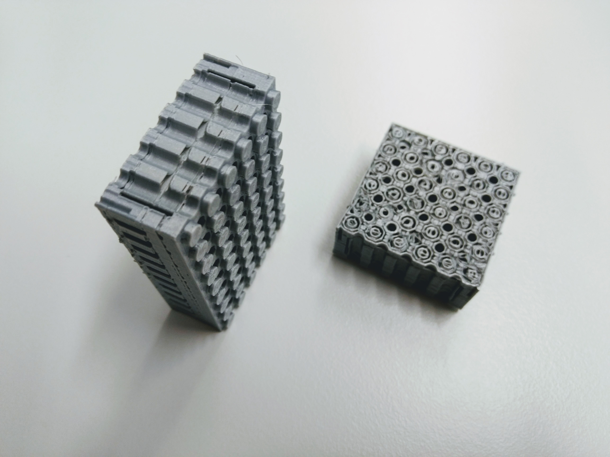

# PELA Blocks
## Slicer Recommmendations

Our experience with different materials are recommended below. Unless otherwise noted, prints are on a Lulzbot Taz 6, 0.5mm extruder, using LulzBot Cura.

Most designs are adjusted to print upright with any layer height. There is very little infill with most designs so using 50% does not greatly affect print speed. Adjust settings to minimize "hop and hunt" during printing on the intricate inner geometry. Avoid "brim" and "support" options if possible as they require difficult post-processing. Most models are do not require supports, but some models offer a switch for minimal, pre-placed supports added to the model. Minimize bed heating if you find the bottom edge distorted by melting.

# Disable slicer print supports

Look for `print_supports = true;` in the model to enable or disable print-time support generated into the model to minimize post-processing.

# Innofil rPET

Made from recycled plastic bottles. Note that the overextrusion is for aesthetics- skip if you don't care about translucency.

## `PELA_print_parameters.scad`

`large_nozzle = true;` (if nozzle >= 0.5mm)

`flexible_filament = false;`

`top_tweak = 0.04;`

`bottom_tweak = 0.10;`

`axle_hole_tweak = 0.04;`

## Slicer Settings

`Layer Height: 0.25`     (for transparency- taller is fine and prints faster)

`Print Temp: 245C`

`Build Plate: 85C`

`Flow: 105%`

`Fan: 30%`

`Retraction: 8.5mm`

`Retraction Speed: 25mm/s`

`Speed: 80mm/s`

`Bottom Speed: 40mm/s`

`Support: None`   (see 'PEL-print-parameters.scad' where support can be added to some models)

`Adhesion: Skirt`

`Infill: 20%`   (minimal effect, most models this can be 50% without taking more time)

`Wall Line Count: 1`

`Fill Gaps Between Walls: Nowhere`

Optional Finish: Lightly sand the outer surface and spray with a clear polimer.

# Innofil Pro1

A nice engineering co-polimer with good gemetric stability and able to print fast and hold well to the print bed. It has good flexture- more than PET but still rigid.

## `PELA_print_parameters.scad`

`large_nozzle = true;` (if nozzle >= 0.5mm)

`flexible_filament = false;`

`top_tweak = -0.05;`

`bottom_tweak = 0.08;`

`axle_hole_tweak = 0.02;`

## Slicer Settings

`Layer Height: 0.25`   (the manufacturer states lower layer heights are stronger and more aesthetic)

`Fan: 20%`   (lower speed is stronger layer adhesion, more speed gives cleaner geometry)

# Colorfabb NGEN

## `PELA_print_parameters.scad`

`large_nozzle = true;` (if nozzle >= 0.5mm)

`flexible_filament = false;`

`top_tweak = -0.01;`

`bottom_tweak = 0.08;`

`axle_hole_tweak = 0.04;`

## Slicer Settings

`Layer Height: 0.3`   (or smaller for aesthetics and when there is side text in the model)

`Print Temp: 255C`

`Initial Print Temp: 250C`

`Build Plate: 85C`

`Flow: 95%`

`Fan: 50%`

`Enable Coasting: true`

`Speed: 60mm/s`

`Wall Speed: 30mm/s`

`Support: None`

`Adhesion: Skirt`

`Infill: 20%`   (minimal effect, most models this can be 50% without taking more time)

`Wall Line Count: 1`

`Fill Gabs Between Walls: Nowhere`

Works well despite a slightly slippery surface finish. As with other PET/co-copolymer filaments, unless you seek transparency then do not overextude. Consider more fan if layer adhesion is sufficent (knobs are particularly sensitive to delamination). Lower or disable the fan for better layer adhesion.

# Colorfabb NGEN Flex

Works well on Flexistruder with 0.6mm nozzle. Basically the same settings as NGEN. Better results due to the extra flexibility.

`flexible_filament = true;`   (this results in longer top knobs help it maintain grip while flexing)

`Fan: 50%`  (or less for better inter-layer adhesion)

# ColorFabb HT

Avoid. It is quite stiff and has slippery finish. It takes a long time to clean this sticky stuff from your printer.

# NinjaTek NinjaFlex

Works well on Flexistruder with 0.6mm nozzle. . Gluestick acts as a release agent that protects the PEI print surface from damage, or better use plain glass with gluestick.

`flexible_filament = true;`   (this results in longer top knobs help it maintain grip while flexing)

# PLA

OK if you don't have other choices. It is stiff and chips easily so part fit and lifetime are not as good as more flexible materials. Avoid bed heating as it can "elephant foot" the lower socket connectors.

Not all brands of PLA are the same. Ultimaker brand PLA is more flexible than generics. Other companies also offer soft formulations.

# ABS

This is a good material if you are familiar with handling ABS shinkage. This is not much of an issue if your parts are not too large or too tall. LEGO is made from ABS because it has many nice properties if you know how to minimize lift and delamination due to thermal contraction in larger parts.

Not all brands of ABS are the same. Village Plastics ABS gives better results than some others.

## `PELA_print_parameters.scad`

`flexible_filament = false;`

`top_tweak = 0.04;`

`bottom_tweak = -0.02;`

## Slicer Settings

`Adhesion: Brim`   (check the slicer's preview image. If the brim pollutes the inside of the bottom connectors that creates difficult post-processing. Consider alaternatives like `Adhesion: Raft` or `Adhesion: Skirt` with a PEI sheet, glue stick, or unscented extra hold hairspray. Minimize bed heating as it can "elephant foot" the lower socket connectors.)

`Infill: 20%`   (minimal effect, most models this can be 50% without taking more time)

`Wall Line Count: 1`

`Fill Gaps Between Walls: Nowhere`

# Taulman Bridge Nylon

A very nice material for PELA blocks. Use a bed of watery PVA white glue. Amazing strength, but a bit slippery and and stringy requires cleanup unless the settings are right. Speed is your friend- print fast and retract fast and far, also "coast" at the end of prints to minimize stringing.

## `PELA_print_parameters.scad`

`flexible_material = true;`

`top_tweak = -0.02;`

`bottom_tweak = 0.15;`

`axle_hole_tweak = 0.06;`

## Slicer Settings

`Layer Height: 0.3`

`Fill gaps between walls: Nowhere`       (Use Everywhere if the block is printed tilted or on the side)

`Keep Heating: No`      (Bed heater can be disabled after the print)

`Retraction Distance: 3mm`

`Retraction Speed: 20 mm/s`

`Print Speed: 100 mm/s`

`Number of Slow Layers: 1`

`Equalize Filament Flow: Yes`     (Move faster over thin walls)

`Print Cooling: 100%`

`Enable Coasting: Yes`    (Stop extrusion before the end of a segment to minimize oozing)

# Biofila Silk

This is one of the most attractive filaments and biodegradable. It is between PLA and ABS is flexability and durability. Make sure you have good bed adhesion and adjust the settings for quick long retraction to minimize stringing in the block bottom connector.

## `PELA_print_parameters.scad`

`flexible_material = true;`

`top_tweak = -0.02;`

`bottom_tweak = 0.15;`

`axle_hole_tweak = 0.06;`

## Slicer Settings

`Layer Height: 0.25`

`Printing Temperature: 175C`

`Build Plate: 60C`

`Keep Heating: No`      (Bed heater can be disabled after the print)

`Infill: 50%`    (minimal impact on time)

`Fill gaps between walls: Nowhere`       (Use Everywhere if the block is printed tilted or on the side)

`Retraction Distance: 3mm`

`Retraction Speed: 20 mm/s`

`Print Speed: 70 mm/s`

`Number of Slow Layers: 1`

`Equalize Filament Flow: Yes`     (Move faster over thin walls)

`Print Cooling: 100%`

`Enable Coasting: Yes`    (Stop extrusion before the end of a segment to minimize oozing)
